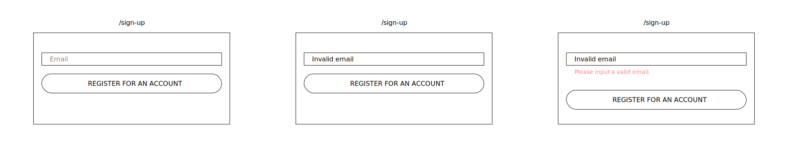
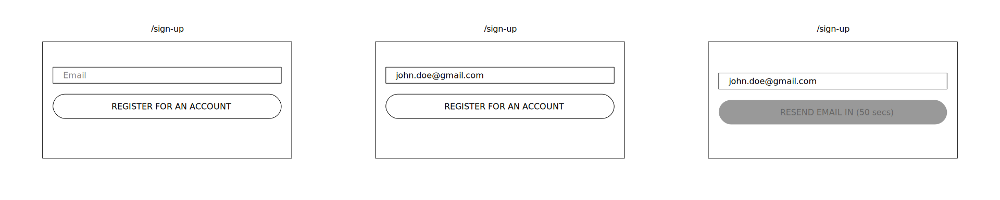

# Application Documentation

## Table of contents

-   [Table of contents](#table-of-contents)
-   [Feature: Account Creation](#feature-account-creation)
    -   [Scenario: User visits sign up page when logged in](#scenario-user-visits-sign-up-page-when-logged-in)
    -   [Scenario: User provides an invalid email address](#scenario-user-provides-an-invalid-email-address)
    -   [Scenario: User provides an email address associated to an existing account](#scenario-user-provides-an-email-address-associated-to-an-existing-account)
    -   [Scenario: User provides an email address](#scenario-user-provides-an-email-address)
    -   [Scenario: User registers in quick succession](#scenario-user-registers-in-quick-succession)
    -   [Scenario: User has not received the email address verification email](#scenario-user-has-not-received-the-email-address-verification-email)
    -   [Scenario: User clicks on an expired verify email link](#scenario-user-clicks-on-an-expired-verify-email-link)
    -   [Scenario: Valid verify email link clicked](#scenario-valid-verify-email-link-clicked)
    -   [Scenario: Invalid value provided](#scenario-invalid-value-provided)
    -   [Scenario: Successful account Creation](#scenario-successful-account-creation)

## Feature: Account Creation

**As** a user  
**I want** to create an account  
**So that** I can securely access the streaming platform

### Scenario: User visits sign up page when logged in

**Given** I am logged in  
**When** I visit the sign up page
**Then** I should be redirected to the application's dashboard

### Scenario: User provides an invalid email address

**Given** I am on the sign up page
**And** I am not logged in  
**When** I provide an invalid email address
**Then** I should be informed that the email is invalid

### Scenario: User provides an email address associated to an existing account

**Given** I am on the sign up page  
**And** I am not logged in  
**When** I provide an email address that is associated to an existing account  
**Then** I should be informed that the email address is associated to an account  
**And** the option to login instead should be provided

### Scenario: User provides an email address

**Given** I am on the sign up page  
**And** I am not logged in  
**When** I provide an email address
**Then** my email address should be saved  
**And** I should receive a verification email  
**And** I should be informed to check my email account

### Scenario: User registers in quick succession

**Given** I am on the sign up page  
**And** I am not logged in  
**And** I have registered with my email address  
**And** it is less than 1 minute since I registered  
**When** I provide my email address
**Then** I should be asked to wait until 1 minute elapses  
**And** I shoud receive a new verification email

### Scenario: User has not received the email address verification email

**Given** I am on the sign up page  
**And** I am not logged in  
**And** I have registered with my email address  
**And** it has been more than 1 minute since I registered  
**When** I provide my email address
**Then** A new verification email should be sent to my email address  
**And** I should be informed to check my email account

### Scenario: User clicks on an expired verify email link

**Given** I have received the verification email  
**And** I am not logged in  
**And** it has been more than 24 hours since I received the email address verification email  
**When** I click on the verification link  
**Then** I should be navigated to the verification code resent page  
**And** I should receive a new verification email  
**And** I should be informed to check my email

### Scenario: Valid verify email link clicked

**Given** I have received the verification email  
**And** I am not logged in  
**When** I click on the verification link  
**Then** I should be navigated to the email verified page  
**And** a link to the complete setup page should be provided

### Scenario: Invalid value provided

**Given** I am in the complete account setup page  
**And** I am not logged in  
**When** I provide an invalid value  
**Then** I should be informed that the value is invalid

### Scenario: Successful account Creation

**Given** I am in the complete account setup page  
**And** I am not logged in  
**When** I provide valid credentials to create an account  
**Then** my account should be created successfully  
**And** I should receive an account created successfully email  
**And** I should be navigated to the login page
**And** I should see a welcome message on the login page
**And** my verification link should be invalidated
